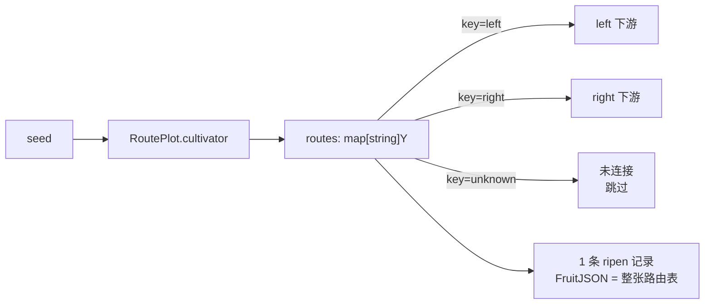

# pkg/plot/plot_route.go

> 📅 最后更新日期: 2026/09/24

`plot_route.go` 定义 `RoutePlot[S, Y]`：一种**定向转发**节点。它的 `cultivator` 返回的不是单个 fruit，而是一张路由表 `map[string]Y`，key 为目标下游名称，value 为要发给该下游的 yield。

因此与 `Plot` 的「全下游广播」不同，`RoutePlot` 可以做到「不同下游收到不同数据」，且**未被路由到的下游不会收到任何数据**。

## 作用

- 提供泛型节点 `RoutePlot[S, Y]`：一颗 seed → 按名称定向投递到若干下游。
- 复用 `basePlot[S, map[string]Y, Y]` 共享骨架（见 `plot_base.md`），只实现 `ripenSeed` 成功钩子。
- 让「分发策略」由业务函数决定，而不是由图的拓扑决定。

## 核心对象

### `RoutePlot[S, Y]` 结构

```go
type RoutePlot[S any, Y any] struct {
	*basePlot[S, map[string]Y, Y]
}
```

| 泛型参数 | 语义 |
|---------|------|
| `S` | 种子输入类型，即 `cultivator` 的入参类型 |
| `Y` | **单个**下游 yield 类型；路由表的值类型为 `Y`，底层 `basePlot` 的 yield 类型也是 `Y` |

注意本节点「结果类型」是 `map[string]Y`（整张路由表会作为一条 `ripen` 记录被持久化），而向下游输出的类型是 `Y`。

## 公开函数

### `NewRoutePlot[S, Y](name string, cultivator func(S) (map[string]Y, error), opts ...Option) *RoutePlot[S, Y]`

| 参数 | 含义 |
|------|------|
| `name` | plot 名称，在 `Farm` 中需唯一 |
| `cultivator` | 路由函数，返回 `map[下游名]yield` 或错误 |
| `opts` | 可选配置（见 `option.md`） |

实现要点与 `NewPlot` 相同：先声明 `var p *RoutePlot[S, Y]`，再构造 `newBasePlot[S, map[string]Y, Y]` 并注入一个调用 `p.ripenSeed(...)` 的闭包，最后把 base 赋给 `p`。闭包捕获的 `p` 在 `StartAsync` 之后才被调用，因此赋值顺序安全。

### `ripenSeed(seedPayload runtime.Payload[S], routes map[string]Y, startTime time.Time)`（未导出）

成功路径，由 `basePlot.tend` 在路由函数返回 `nil` 错误时调用：

1. `AddFruitNum(1)`、`reportProgress()`——**无论路由到几个下游，一颗 seed 只记 1 个 fruit**；
2. `eventClient.Emit("fruit", []int{seedID})` 分配 `fruitID`；
3. 写 `logInlet.SeedRipen`（路由表截断到 25 rune）与 `lifecycleInlet.SeedRipen`（`FruitJSON` 为整张路由表的 JSON）；
4. 遍历路由表 `routes`：
   - `ch, ok := p.yieldChans[nextPlot]`；`!ok`（该目标未连接）→ `continue` 跳过，不影响其他路由项；
   - `AddDownstreamYieldNum(nextPlot, 1)`——每个被路由到的下游恰好 +1；
   - `eventClient.Emit("seed", []int{fruitID})` 分配下游 seed 事件 ID（父事件为 `fruitID`）；
   - 写 `logInlet.SeedInput`（yield 截断到 50 rune）与 `lifecycleInlet.SeedInput`；
   - 发送 `runtime.Payload[Y]{Value: yield, EventID: downstreamSeedID}`。

## 关键流程

### 与 `Plot` 的差异



| 对比项 | `Plot` | `RoutePlot` |
|--------|--------|-------------|
| 结果类型 | `F` | `map[string]Y` |
| 投递范围 | 所有已连接下游各 1 颗 | 仅路由表中且**已连接**的目标 |
| 各下游收到的数据 | 完全相同 | 可完全不同（各取路由表中自己的 value） |
| 未连接目标 | 不适用 | 静默跳过 |
| `fruit` 计数 | +1 | +1 |
| 下游 yield 计数增量 | 每个下游 +1 | 每个被路由到的下游 +1 |

### 空路由表 / `nil`

`cultivator` 返回 `nil` map 或空 map 时：仍会记 1 条 `ripen`（`FruitJSON` 为 `null` 或 `{}`），但**不产生任何下游 yield**。

## 使用示例

### Standalone 路由

```go
package main

import (
	"fmt"

	"github.com/Mr-xiaotian/CelestialGrow/pkg/plot"
)

func main() {
	route := plot.NewRoutePlot("route", func(seed int) (map[string]string, error) {
		routes := map[string]string{}
		if seed%2 == 0 {
			routes["even"] = fmt.Sprintf("even-%d", seed)
		} else {
			routes["odd"] = fmt.Sprintf("odd-%d", seed)
		}
		return routes, nil
	}, plot.WithTenders(2))

	route.Run([]int{1, 2, 3})

	records, err := route.Harvest()
	if err != nil {
		panic(err)
	}
	for _, r := range records {
		fmt.Println(r.SeedJSON, r.Status, r.FruitJSON)
	}
}
```

### Farm 中按目标分流

```go
f := farm.NewFarm("route_demo", "INFO")

left := plot.NewPlot("left", func(seed string) (string, error) { return "L:" + seed, nil })
right := plot.NewPlot("right", func(seed string) (string, error) { return "R:" + seed, nil })
route := plot.NewRoutePlot("route", func(seed int) (map[string]string, error) {
	return map[string]string{"left": fmt.Sprintf("%d", seed)}, nil
})

_ = f.AddPlot(route, left, right)
// 只连 route → left、route → right；路由表中未出现的目标不会收到数据
_ = f.Connect([]plot.PlotNode{route}, []plot.PlotNode{left, right})
_ = f.Run(map[string][]any{"route": {1, 2, 3}})
```

> 由于下游 `left` / `right` 的 `S` 是 `string`，`RoutePlot` 的 `Y` 也必须是 `string`，否则 `Connect` 阶段就会因类型不匹配报错。

## 注意事项

- 路由表的 key 必须与下游 plot 的 `name` 完全一致；名称不匹配（或该目标未被 `Connect`）时**静默跳过**，不会报错也不会产生日志。
- 路由表会被整体序列化为一条 `ripen` 生命周期记录的 `FruitJSON`；若 map 内容很大，建议在业务侧先裁剪。
- 由于 `map` 迭代顺序随机，向多个下游投递的**顺序不确定**；但每个目标各自只会收到自己的那一颗 yield。
- `AddDownstreamYieldNum` 只对已连接目标调用，因此下游 `GetSeedNum` 与实际收到的 yield 数严格一致。
- 不要让 `cultivator` 修改并复用同一个 map（并发 tend 调用下会数据竞争）；每次返回新 map 最安全。
