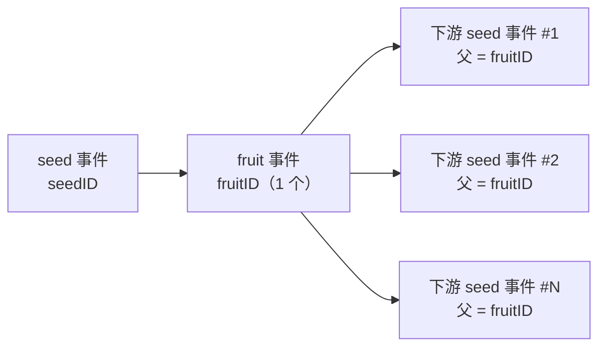

# pkg/plot/plot_split.go

> 📅 最后更新日期: 2026/09/24

`plot_split.go` 定义 `SplitPlot[S, F]`：一种**一拆多**节点。它的 `cultivator`（构造参数名为 `splitter`）返回 `[]F`，节点再把切片中的每个元素单独作为一颗下游 yield 转发。

适合「一个任务派生出 N 个子任务」的场景（如一个目录拆成多个文件、一份订单拆成多个子项）。

## 作用

- 提供泛型节点 `SplitPlot[S, F]`：一颗 seed → 多颗下游 yield。
- 复用 `basePlot[S, []F, F]` 共享骨架（见 `plot_base.md`），只实现 `ripenSeed` 成功钩子。
- 保持「**一颗 seed 只记一条 `ripen` 记录**」的统计口径：拆分出多少个元素，仍算一次成功培育。

## 核心对象

### `SplitPlot[S, F]` 结构

```go
type SplitPlot[S any, F any] struct {
	*basePlot[S, []F, F]
}
```

| 泛型参数 | 语义 |
|---------|------|
| `S` | 种子输入类型，即 `splitter` 的入参类型 |
| `F` | 拆分后的**单个元素**类型；结果类型为 `[]F`，向下游输出的类型为 `F` |

## 公开函数

### `NewSplitPlot[S, F](name string, splitter func(S) ([]F, error), opts ...Option) *SplitPlot[S, F]`

| 参数 | 含义 |
|------|------|
| `name` | plot 名称，在 `Farm` 中需唯一 |
| `splitter` | 拆分函数，返回 `[]F` 或错误 |
| `opts` | 可选配置（见 `option.md`） |

实现要点与 `NewPlot` 相同：先声明 `var p *SplitPlot[S, F]`，再构造 `newBasePlot[S, []F, F]` 并注入调用 `p.ripenSeed(...)` 的闭包，最后赋值 `p`。

> 注意：`splitter` 返回 `(nil, nil)` 也是合法成功——此时不产生任何下游 yield，但依然记 1 条 `ripen`（`FruitJSON` 为 `null`）。

### `ripenSeed(seedPayload runtime.Payload[S], fruits []F, startTime time.Time)`（未导出）

成功路径，由 `basePlot.tend` 在 `splitter` 返回 `nil` 错误时调用：

1. `AddFruitNum(1)`、`reportProgress()`——**只加 1**，与 `len(fruits)` 无关；
2. `eventClient.Emit("fruit", []int{seedID})` 分配**唯一**的 `fruitID`（整次拆分共用一个 fruit 事件）；
3. 写 `logInlet.SeedRipen`（`[]F` 的字符串表示截断到 25 rune）与 `lifecycleInlet.SeedRipen`（`FruitJSON` 为整个切片的 JSON）；
4. 遍历 `p.yieldChans`（即**所有**已连接下游），对每个下游：
   - `AddDownstreamYieldNum(nextPlot, len(fruits))`——一次性把该下游收到的 yield 数加上 `len(fruits)`；
   - 内层遍历 `fruits`，为**每个元素**：
     - `eventClient.Emit("seed", []int{fruitID})` 分配独立的下游 seed 事件 ID（父事件都是同一个 `fruitID`）；
     - 写 `logInlet.SeedInput`（元素截断到 50 rune）与 `lifecycleInlet.SeedInput`；
     - 发送 `runtime.Payload[F]{Value: fruit, EventID: downstreamSeedID}`。

## 关键流程

### 事件 ID 与父子关系



- 一次拆分只分配 1 个 `fruitID`，`N` 个下游 seed 事件都以它作为父事件；
- 日志侧会为每个元素各写一条 `SeedInput`，生命周期侧同理（`InputEventID` 各不相同）。

### 与 `Plot` / `RoutePlot` 的差异

| 对比项 | `Plot` | `SplitPlot` | `RoutePlot` |
|--------|--------|-------------|-------------|
| 结果类型 | `F` | `[]F` | `map[string]Y` |
| 投递范围 | 所有已连接下游各 1 颗 | 所有已连接下游各 `len(fruits)` 颗 | 仅路由表命中的目标 |
| 下游 yield 计数增量 | 每下游 +1 | 每下游 +`len(fruits)` | 每命中目标 +1 |
| `fruit` 计数 | +1 | +1（与元素数无关） | +1 |
| 目的地下游收到的数据 | 相同 | 相同（同一份切片） | 可能各不相同 |

### 空切片与全下游广播

- `fruits` 为空（`nil` 或 `[]F{}`）：`AddDownstreamYieldNum(nextPlot, 0)` 且内层循环不执行，**下游收不到任何数据**（但会正常收到上游收尾时的 seal）；
- `fruits` 有 `N` 个元素：**每个已连接下游都会收到全部 `N` 个元素**——`SplitPlot` 是「拆分 + 广播」，不是「按目标分发」（按目标分发请用 `RoutePlot`）。

## 使用示例

### Standalone 拆分

```go
package main

import (
	"fmt"
	"strings"

	"github.com/Mr-xiaotian/CelestialGrow/pkg/plot"
)

func main() {
	split := plot.NewSplitPlot("split", func(seed string) ([]string, error) {
		if seed == "" {
			return nil, nil
		}
		return strings.Split(seed, ","), nil
	}, plot.WithTenders(2))

	split.Run([]string{"a,b,c", ""})

	records, err := split.Harvest()
	if err != nil {
		panic(err)
	}
	for _, r := range records {
		fmt.Println(r.SeedJSON, r.Status, r.FruitJSON)
	}
}
```

### Farm 中拆分后再处理

```go
f := farm.NewFarm("split_demo", "INFO")

// split：把 "1,2,3" 拆成 int 列表
split := plot.NewSplitPlot("split", func(seed string) ([]int, error) {
	parts := strings.Split(seed, ",")
	values := make([]int, 0, len(parts))
	for _, part := range parts {
		v, err := strconv.Atoi(strings.TrimSpace(part))
		if err != nil {
			return nil, err
		}
		values = append(values, v)
	}
	return values, nil
})

// head：对每个拆出来的 int 再处理
head := plot.NewPlot("head", func(seed int) (int, error) {
	return seed * 10, nil
}, plot.WithTenders(2))

_ = f.AddPlot(split, head)
_ = f.Connect([]plot.PlotNode{split}, []plot.PlotNode{head}) // 上游 yield int → 下游 seed int
_ = f.Run(map[string][]any{"split": {"1,2,3"}})
```

## 注意事项

- `SplitPlot` 的 `F` 是**元素类型**，`ConnectTo` 时下游的 `S` 必须等于 `F`（不是 `[]F`）；这是最容易踩的类型不匹配点。
- 观察者看到的进度按 **seed 粒度**推进（`GetCompleted` 每次 `ripenSeed` 只 +1），不会因为拆出 5 个元素而 +5。
- 下游的 `GetSeedNum()` 会因 `AddDownstreamYieldNum(len(fruits))` 而相应增长，因此「拆分前后的种子总数对不上」是预期行为——下游看到的是拆分后的种子量。
- `splitter` 返回的切片会被广播给所有下游，请勿在下游修改切片元素（可能引发数据竞争），或由 `splitter` 返回每次新建的切片。
- 若 `fruits` 元素数量很大，注意 `seedChan` 缓冲与下游并发度；缓冲满时上游 `ripenSeed` 会在发送处阻塞。
