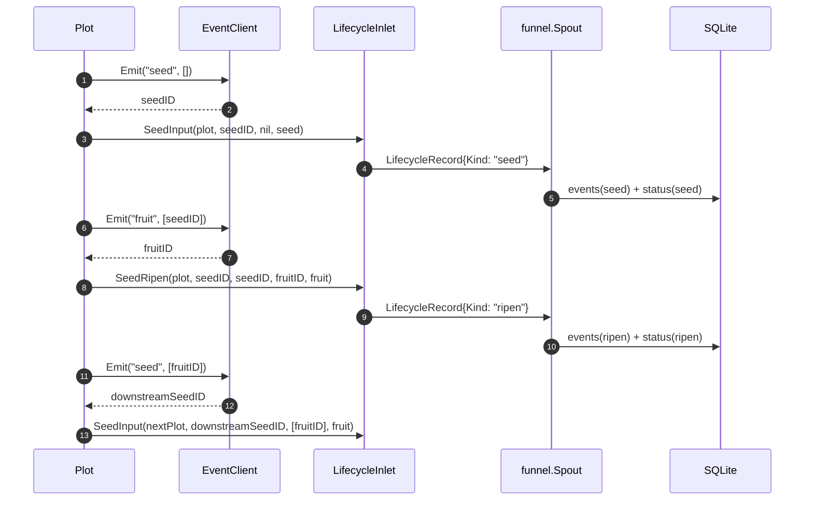

# pkg/runtime/event.go

> 📅 最后更新日期: 2026/09/24

`event.go` 定义运行时的事件 ID 分配抽象。它把「为每一次 seed / fruit / weed / seal 事件分配唯一数字 ID」封装为最小接口 `EventClient`，并提供进程内的默认实现 `LocalEventClient`。`pkg/plot` 的各 plot 节点通过该抽象，把「事件 ID 如何生成」从调度逻辑中解耦出来。

## 作用

- 定义**事件 ID 分配器**的最小契约 `EventClient`。
- 提供进程内、并发安全的默认实现 `LocalEventClient`。
- 让 plot 在不依赖任何全局状态的前提下，为每次业务事件（seed 进入、fruit 产出、weed 失败、seal 传播）拿到单调递增的整数 ID，从而在 `pkg/persist` 的 SQLite 中串成完整因果链。

> 本包**只有** `EventClient`、`LocalEventClient`、`NewLocalEventClient` 与 `(*LocalEventClient).Emit` 四个导出符号；没有 `EventKind` 枚举，也没有 `Event` 结构体。事件种类（`"seed"` / `"fruit"` / `"weed"` / `"seal"`）以字符串字面量形式由 `pkg/plot` 传入 `Emit` 的 `type_` 参数。

## 核心对象

### `EventClient` 接口

事件客户端的最小发射能力。整个 runtime 包只要求它能完成一件事——**分配一个事件 ID**。

```go
type EventClient interface {
    Emit(type_ string, parents []int) int
}
```

| 方法 | 用途 |
|------|------|
| `Emit(type_ string, parents []int) int` | 声明一次类型为 `type_`、父事件 ID 列表为 `parents` 的事件，并返回分配到的事件 ID |

> `type_` 与 `parents` 在 `LocalEventClient` 的实现里**仅参与签名契约**——默认实现既不持久化 `type_`，也不存储 `parents`，只返回递增的本地 ID。二者的实际含义由调用方（`pkg/plot`）解释，并随 `persist.LifecycleRecord` 落地到 SQLite。这样设计允许未来用分布式 ID 生成器替换默认实现，而不必改动 plot 代码。

### `LocalEventClient` 结构

进程内的事件 ID 分配器。`newBasePlot` 在构造每个 plot 时默认创建并使用它。

```go
type LocalEventClient struct {
    mu     sync.Mutex
    nextID int
}
```

| 字段 | 类型 | 含义 |
|------|------|------|
| `mu` | `sync.Mutex` | 保护 `nextID` 的互斥锁，使 `Emit` 在多协程下也是原子的 |
| `nextID` | `int` | 下一个待分配的事件 ID（从 `0` 开始，首次 `Emit` 返回 `1`） |

### 构造与发射

```go
func NewLocalEventClient() EventClient

func (e *LocalEventClient) Emit(type_ string, parents []int) int
```

| 函数 | 行为 |
|------|------|
| `NewLocalEventClient()` | 返回一个 `EventClient` 接口值，内部持有零值的 `LocalEventClient`（`nextID = 0`） |
| `Emit(type_, parents)` | 加锁、`nextID++`、返回新的 `nextID`、解锁。并发安全，进程内单调递增 |

```go
c := runtime.NewLocalEventClient()
id1 := c.Emit("seed", []int{})      // 1
id2 := c.Emit("fruit", []int{id1})  // 2
```

> `LocalEventClient` 不存储历史记录——它只负责「分配 ID」。如果需要在进程退出后仍能追溯事件链，请通过 plot 的 `lifecycleInlet` 配合 `persist.LifecycleRecordHandler` 写入 SQLite。

## 公开符号一览

| 符号 | 类型 | 说明 |
|------|------|------|
| `EventClient` | `interface` | 事件 ID 分配的最小契约 |
| `LocalEventClient` | `struct`（导出） | 进程内、并发安全的默认实现 |
| `NewLocalEventClient` | `func() EventClient` | 构造方法，返回接口值 |
| `(*LocalEventClient).Emit` | `func(string, []int) int` | 分配并返回新 ID |

## 事件的发出点（plot 内部）

`Seed` / `Seal` / `witherSeed` / `sprout` 定义在 `basePlot`（`plot_base.go`）；`ripenSeed` 由成功路径注入，`Plot`、`SplitPlot`、`RoutePlot` 各有一份实现。全部调用点如下：

| 触发方法 | 所在类型 | `type_` | `parents` | 说明 |
|---------|---------|---------|-----------|------|
| `Seed` | `basePlot` | `"seed"` | `[]int{}`（空） | 外部注入单颗种子，分配该种子的起始事件 ID；`Source` 字段留空 |
| `Seal` | `basePlot` | `"seal"` | `[]int{}`（空） | 外部终止信号，`Payload.Source` 记为 `sourceInput` |
| `witherSeed` | `basePlot` | `"weed"` | `[]int{seedID}` | 培育最终失败（cultivator 返回 error、`retryIf` 拒绝重试，或 panic） |
| `ripenSeed` | `Plot` | `"fruit"` | `[]int{seedID}` | 培育成功，分配 fruitID；一颗 fruit 转发为一颗下游 yield |
| `ripenSeed` | `Plot` | `"seed"` | `[]int{fruitID}` | 向上游登记的每个下游分配新的 seedID |
| `ripenSeed` | `SplitPlot` | `"fruit"` + 每颗 fruit 一条 `"seed"` | 同上 | 一次成功产出多颗 fruit，逐颗转发 |
| `ripenSeed` | `RoutePlot` | `"fruit"` + 每条路由一条 `"seed"` | 同上 | 按路由表把 yield 分发到命中的下游 |
| `sprout` 收尾 | `basePlot` | `"seal"` | `[]int{...所有已收上游 sealID...}` | 输入关闭且无在途种子后，向所有下游广播 seal |

> 完整的因果链靠 `parents` 传递：seed → fruit → seed（下游）→ fruit（下游）→ …，其中的 seed / fruit / weed 事件由 SQLite 的 `events` + `event_parents` 表持久化。**seal 事件不落库**：它的 ID 只在内存中的 `sealedFrom` map 里用作后续 seal 事件的 `parents`。

> 同一个 `EventClient` 实例被农场内所有 plot 共享：`Farm.AddPlot` 在注册时调用 `PlotNode.SetEventClient(f.eventClient)` 注入，因此整个 Farm 范围内的事件 ID **单调连续**，不会出现 ID 复用。单机 standalone 模式下，plot 各自使用 `newBasePlot` 中默认创建的 `LocalEventClient`。

## 与 `pkg/persist` 的对接

事件 ID 本身不携带业务信息。`pkg/plot` 把事件 ID、业务数据与来源组装成 `persist.LifecycleRecord`，经由 `persist.LifecycleInlet` → `funnel.Spout` → `persist.LifecycleRecordHandler` 落地到 SQLite。

`"seed"` / `"fruit"` / `"weed"` 会被 `LifecycleRecordHandler.HandleRecord` 的 `switch record.Kind` 分派处理；`"seal"` 不产生 `LifecycleRecord`：

| `Emit` 的 `type_` | `LifecycleRecord.Kind`（常量 / 字面量） | `events.event_type` | `status.status` | 说明 |
|-------------------|----------------------------------------|---------------------|-----------------|------|
| `"seed"` | `lifecycleSeed` / `"seed"` | `"seed"` | `"seed"` | 种子进入系统，写入 `seed_json` |
| `"fruit"` | `lifecycleRipen` / `"ripen"` | `"ripen"` | `"ripen"` | 培育成功，写入 `fruit_json` |
| `"weed"` | `lifecycleWither` / `"wither"` | `"wither"` | `"wither"` | 培育失败，写入 `wither_type` / `wither_message` |
| `"seal"` | （不产生 `LifecycleRecord`） | — | — | 仅作为内存中的因果链节点，不落库 |

> 注意命名分层：`Emit` 的 `type_` 用的是 `"fruit"` / `"weed"`（植物学隐喻），而 `LifecycleRecord.Kind` 与落库值用的是 `"ripen"` / `"wither"`（状态语义）。`events.event_type` 存的是 `Kind`，因此实际取值是 `"seed"` / `"ripen"` / `"wither"`。

每条落库的 `LifecycleRecord` 都通过 `event_id` 与 `event_parents` 表建立父子边，从而在 SQLite 中可以重建整张因果图。

## 关键流程



## 使用示例

### 替换默认实现

如果要把本地自增 ID 换成雪花 ID、UUID 哈希或外部服务分配器，只需实现 `EventClient` 接口，并通过 `SetEventClient` 注入：

```go
type snowflakeClient struct {
    // 内部状态略
}

func (s *snowflakeClient) Emit(type_ string, parents []int) int {
    // 分配全局唯一 ID（具体策略略）
    return nextSnowflake()
}

f := farm.NewFarm("demo", "INFO")
client := &snowflakeClient{}

// 在注册时注入；也可注册后对单个 plot 覆盖
if err := f.AddPlot(plotA, plotB); err != nil {
    panic(err)
}
plotA.SetEventClient(client)
plotB.SetEventClient(client) // 同一实例可被多个 plot 共享
```

> `Emit` 的 `type_` / `parents` 参数必须出现在签名中。即使自定义实现不读取它们，也必须保留，否则无法实现 `runtime.EventClient`。

### 仅查看当前 ID 分配状态

`LocalEventClient` 不提供 `Len()` / `Current()` 之类的查询方法；如需观察当前已分配数量，可在外面包一层：

```go
type countedClient struct {
    inner runtime.EventClient
    n     atomic.Int64
}

func (c *countedClient) Emit(type_ string, parents []int) int {
    id := c.inner.Emit(type_, parents)
    c.n.Add(1)
    return id
}
```

## 重要细节

- **并发安全**：`LocalEventClient.Emit` 用 `sync.Mutex` 串行化 `nextID++`，多协程并发调用下返回的 ID 仍唯一且单调递增。
- **不持久化**：`LocalEventClient` 是「**分配器**」而非「**存储器**」，全部状态只有 `nextID` 一个 `int`。进程退出后，事件 ID 的语义只能借助 SQLite 中的 `events` 表追溯。
- **接口设计动机**：`type_ string, parents []int` 为「未来可能接入分布式追踪系统」预留——替换为 OpenTelemetry / Jaeger 实现时签名已经够用，不需要改 plot。
- **跨 plot 共享**：`Farm.AddPlot` 会把同一个 `EventClient` 实例注入所有实例，保证整个 Farm 范围内事件 ID 单调不重复；因此 SQLite 中既可按 `plot` 局部过滤，也可按 `event_id` 全局追踪。
- **类型标签只是透传**：`LocalEventClient` 自身**不区分** `"seed"` / `"fruit"` / `"weed"` / `"seal"`，只把它们当作调用方语义标签透传，类型落地在 `persist` 侧完成。

## 注意事项

- 不要在外部直接 `&runtime.LocalEventClient{}` 构造；请用 `NewLocalEventClient()`，以拿到 `EventClient` 接口值（便于后续无痛替换实现）。
- `parents` 是「**父事件 ID**」列表，**不是**因果路径上的所有祖先 ID；写入 SQLite 时由 `InsertLifecycleEvent` 在 `event_parents` 表里插入 `(event_id, parent_id)` 边。
- 同一因果链上不要混用两个 `LocalEventClient` 实例——否则同一逻辑任务会被分配不同 ID，破坏 SQLite 中的边关系。
- 若扩展了新的事件类型，请同步更新 `persist.LifecycleRecordHandler.HandleRecord` 的 `switch record.Kind` 分支，否则消费时会返回 `unsupported lifecycle operation: <新类型>`。
