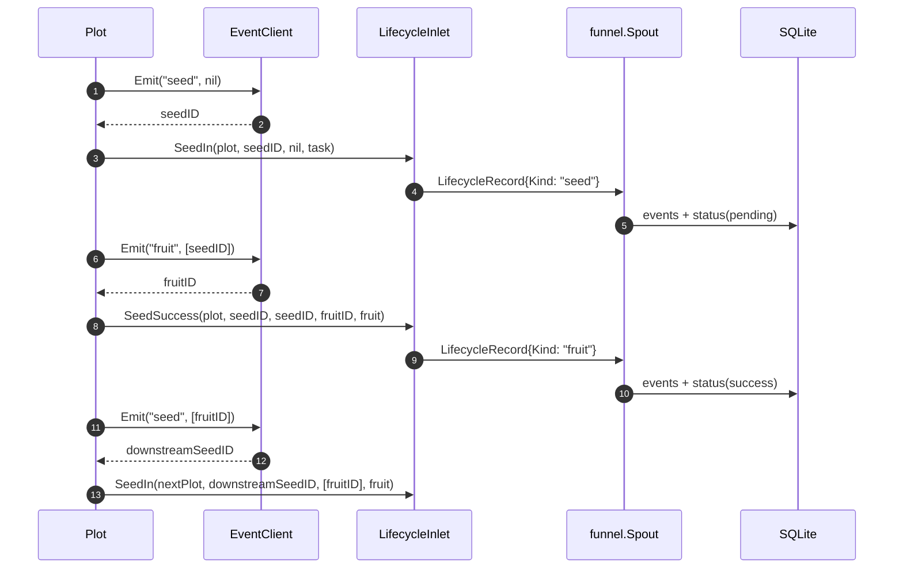

# pkg/runtime/event.go

> 最后更新日期: 2026/09/01

`event.go` 定义运行时的事件 ID 分配抽象。它把「为每一次 seed/fruit/weed/seal 事件分配唯一数字 ID」这件事封装为一个最小接口 `EventClient`，并提供一个进程内的默认实现 `LocalEventClient`。`pkg/plot` 的 `Plot` 通过这个抽象把所有「事件 ID」从具体的分配策略中解耦出来。

## 作用

- 定义**事件 ID 分配器**的最小契约 `EventClient`。
- 提供进程内、线程安全的默认实现 `LocalEventClient`。
- 让 `Plot` 在不依赖任何全局状态的情况下，为每次业务事件（seed 进入、fruit 产出、weed 失败、seal 传播）获得单调递增的整数 ID，从而在 `pkg/persist` 的 SQLite 中能串成完整的因果链。

> 当前源码中**没有**独立的 `EventKind` 枚举或 `Event` 结构体；事件种类（`"seed"` / `"fruit"` / `"weed"` / `"seal"`）以字符串字面量形式出现在 `Plot` 各处，并经由 `persist.LifecycleRecordHandler` 落地到 SQLite 的 `event_type` 字段。

## 核心对象

### `EventClient` 接口

事件客户端的最小发射能力。整个 runtime 包只要求它能完成一件事——**分配一个事件 ID**。

```go
type EventClient interface {
    Emit(type_ string, parents []int) int
}
```

| 方法 | 用途 |
|------|------|
| `Emit(type_ string, parents []int) int` | 声明一次类型为 `type_`、父事件 ID 列表为 `parents` 的事件，并返回分配到的事件 ID |

> `Emit` 的 `type_` 与 `parents` 参数在 `LocalEventClient` 的实现里**仅参与签名契约**——默认实现既不持久化 `type_`，也不存储 `parents`；它只返回递增的本地 ID。`type_` 与 `parents` 的实际记录由调用方（`Plot`）交给 `persist.LifecycleRecordHandler` 写入 SQLite（`events` + `event_parents` 表）。这种设计允许未来用分布式 ID 生成器替换默认实现，而不必改动 `Plot` 的代码。

### `LocalEventClient` 结构

进程内的事件 ID 分配器。`Plot` 在 `NewPlot` 中默认创建并使用它。

```go
type LocalEventClient struct {
    mu     sync.Mutex
    nextID int
}
```

| 字段 | 类型 | 含义 |
|------|------|------|
| `mu` | `sync.Mutex` | 保护 `nextID` 的互斥锁，使 `Emit` 在多协程下也是原子的 |
| `nextID` | `int` | 下一个待分配的事件 ID（从 `0` 开始，首次 `Emit` 返回 `1`） |

### 构造与发射

```go
func NewLocalEventClient() EventClient

func (e *LocalEventClient) Emit(type_ string, parents []int) int
```

| 函数 | 行为 |
|------|------|
| `NewLocalEventClient()` | 返回一个 `EventClient` 接口值，内部持有零值的 `LocalEventClient`（`nextID = 0`） |
| `Emit(type_, parents)` | 加锁、`nextID++`、返回新的 `nextID`；解锁。线程安全，进程内单调递增 |

```go
c := runtime.NewLocalEventClient()
id1 := c.Emit("seed", nil)     // 1
id2 := c.Emit("fruit", []int{id1}) // 2
```

> `LocalEventClient` 不存储历史记录——它只负责「分配 ID」。如果需要在进程退出后仍然持有事件链，请通过 `Plot` 的 `LifecycleInlet` 配合 `persist.LifecycleRecordHandler` 写入 SQLite。

## 公开符号一览

| 符号 | 类型 | 说明 |
|------|------|------|
| `EventClient` | `interface` | 事件 ID 分配的最小契约 |
| `LocalEventClient` | `struct`（导出） | 进程内、线程安全的默认实现 |
| `NewLocalEventClient` | `func() EventClient` | 构造方法，返回接口值 |
| `(*LocalEventClient).Emit` | `func(string, []int) int` | 分配并返回新 ID |

## 事件的发出点（Plot 内部）

`Plot` 在以下 5 个时机调用 `eventClient.Emit`：

| 时机 | 调用点 | `type_` | `parents` | 用途 |
|------|--------|---------|-----------|------|
| 外部 `Seed` 注入单颗种子 | `Plot.Seed` | `"seed"` | `nil` | 给外部输入分配 seedID |
| 培育成功 | `Plot.bearFruit` | `"fruit"` | `[]int{seedID}` | 给成功结果分配 fruitID；父节点为输入 seed |
| 培育失败 | `Plot.bearWeed` | `"weed"` | `[]int{seedID}` | 给失败结果分配 weedID；父节点为输入 seed |
| 转发果实到下游 | `Plot.bearFruit` | `"seed"` | `[]int{fruitID}` | 给下游分配新 seedID；父节点为上游 fruit |
| `sprout` 收尾向所有下游广播 seal | `Plot.sprout` | `"seal"` | `[]int{...所有已收上游 seal ID...}` | 给本 plot 发出的 seal 分配 sealID；父节点为每个上游的 seal 事件 |

> 完整的因果链通过 `parents` 传递：seed → fruit → seed（下游）→ fruit（下游）→ … 由 SQLite 的 `event_parents` 表持久化。

> 同一 `LocalEventClient` 实例被所有 plot 共享（在 `Farm.Run` 中由 `PlotNode.SetEventClient` 注入，或默认采用 `NewLocalEventClient`），因此整个 Farm 范围内的事件 ID 是**单调连续**的，不会出现 ID 复用。

## 事件的订阅点（持久化）

事件 ID 本身不直接携带业务信息，业务信息由 `Plot` 编码进 `Payload` 与 `LogRecord` / `LifecycleRecord` 中并通过 `funnel` 系统发出：

- `payload.EventID` 携带分配到的事件 ID；
- `Payload.Source` 携带来源（外部 input 用 `sourceInput`、内部传播用 plot 名）；
- `Payload.Signal` 携带控制信号（`SignalNone` / `SignalSeal`，详见 `type.md`）。

`Plot` 把这些信息组装成 `persist.LifecycleRecord`，经由 `persist.LifecycleInlet` → `funnel.Spout` → `persist.LifecycleRecordHandler` 落地到 SQLite：

```go
// Plot.Seed
seedID := p.eventClient.Emit("seed", []int{})
p.lifecycleInlet.SeedIn(p.name, seedID, nil, seed)        // → LifecycleRecord{Kind: "seed"}

// Plot.bearFruit
fruitID := p.eventClient.Emit("fruit", []int{seedID})
p.lifecycleInlet.SeedSuccess(p.name, seedID, seedID, fruitID, fruit) // → "fruit"
downstreamSeedID := p.eventClient.Emit("seed", []int{fruitID})
p.lifecycleInlet.SeedIn(nextPlot, downstreamSeedID, []int{fruitID}, fruit) // → "seed"

// Plot.bearWeed
weedID := p.eventClient.Emit("weed", []int{seedID})
p.lifecycleInlet.SeedFailed(p.name, seedID, seedID, weedID, err) // → "weed"

// Plot.sprout 收尾
sealID := p.eventClient.Emit("seal", patents)
// 直接构造 runtime.Payload[F]{Signal: SignalSeal, Source: p.name, EventID: sealID}
// 发到所有 fruitChans；sealedFrom 的 ID 集合作为 parents。
```

### 与 `pkg/persist` 的对接

`persist.LifecycleRecordHandler` 把上述四种事件类型分别落到 SQLite：

| `Emit` 的 `type_` | `LifecycleRecord.Kind` | 落库到 `status` 表的状态 | 说明 |
|-------------------|------------------------|--------------------------|------|
| `"seed"` | `lifecycleSeed` | `pending` | 任务进入系统，待处理 |
| `"fruit"` | `lifecycleFruit` | `success` | 任务成功完成，携带 `ResultJSON` |
| `"weed"` | `lifecycleWeed` | `failed` | 任务失败，携带 `ErrorType` / `ErrorMessage` |
| `"seal"` | （不直接产生 `LifecycleRecord`） | — | 仅作为下游因果链上的事件，状态层面不再单独记录 |

每条 `LifecycleRecord` 都通过 `event_id` 与 `event_parents` 表建立父子边，从而在 SQLite 中可以重建整张因果图。

## 关键流程



## 使用示例

### 替换默认实现

如果需要把事件 ID 换成雪花 ID、UUID 哈希或外部服务的分配器，只需实现 `EventClient` 接口，并通过 `Plot.SetEventClient` 注入：

```go
type snowflakeClient struct{ /* ... */ }

func (s *snowflakeClient) Emit(type_ string, parents []int) int {
    // 分配全局唯一 ID（具体策略略）
    return nextSnowflake()
}

// 在 Farm 装配时统一注入
farm := farm.NewFarm("demo", "INFO")
// ... farm.AddPlot(plotA, plotB)
plotA.SetEventClient(&snowflakeClient{})
plotB.SetEventClient(&snowflakeClient{}) // 同一实例可被多个 plot 共享
```

> `Emit` 的 `type_` / `parents` 参数必须出现在签名中。即使自定义实现里不读取它们，也必须保留这两个参数，否则无法实现 `runtime.EventClient`。

### 仅查看当前 ID 分配状态

`LocalEventClient` 不提供 `Len()` / `Current()` 之类的查询方法；如需观察当前已分配数量，可在外层用一个计数器包一层：

```go
type countedClient struct {
    inner runtime.EventClient
    n     atomic.Int64
}

func (c *countedClient) Emit(type_ string, parents []int) int {
    id := c.inner.Emit(type_, parents)
    c.n.Add(1)
    return id
}
```

## 重要细节

- **线程安全**：`LocalEventClient.Emit` 内部使用 `sync.Mutex` 串行化 `nextID++`，在多协程并发调用下也保证返回的 ID 唯一且单调递增。
- **不持久化**：`LocalEventClient` 是「**分配器**」，不是「**存储器**」；它的全部状态就是 `nextID` 一个 `int`。进程退出后，所有事件 ID 的语义只能借助 SQLite 中的 `events` 表来追溯。
- **接口设计动机**：`type_ string, parents []int` 是为「未来可能要写入分布式追踪系统」预留的——当下游替换为 OpenTelemetry / Jaeger 实现时，签名已经够用，不需要改 `Plot`。
- **跨 plot 共享**：在 `pkg/farm` 中，**所有 plot 共享同一个 `EventClient` 实例**，从而保证整个 Farm 范围内的事件 ID 是单调不重复的；这意味着在 SQLite 中既可以按 `plot` 局部过滤，也可以按 `event_id` 全局追踪。
- **没有的事件类型**：`LocalEventClient` 自身**不区分** `"seed"` / `"fruit"` / `"weed"` / `"seal"`；它只把它们当作「调用方语义标签」在签名里透传，由 `persist` 侧做类型落地。

## 注意事项

- 不要在外部直接 `&runtime.LocalEventClient{}` 构造；请用 `NewLocalEventClient()`，以确保拿到 `EventClient` 接口值（便于未来无痛替换实现）。
- `parents` 列表是「父事件 ID」，**不是**因果路径上的所有祖先 ID；写入 SQLite 时由 `InsertLifecycleEvent` 在 `event_parents` 表里插入 `(child_id, parent_id)` 多对多边。
- 同一进程内不要混用两个 `LocalEventClient` 实例去分配同一因果链上的 ID——否则会出现两个 plot 给同一逻辑任务分配不同 ID 的情况，破坏 SQLite 中的边关系。
- 若你扩展了新的事件类型，请同步更新 `persist.LifecycleRecordHandler.HandleRecord` 的 `switch record.Kind` 分支，否则 `unsupported lifecycle operation: <新类型>` 错误会在 spout 消费时返回。
