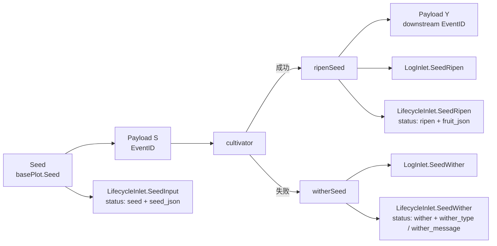

# pkg/runtime/type.go

> 📅 最后更新日期: 2026/09/24

`type.go` 定义了跨包共享的运行时基础类型：管道阶段的统一数据载体 `Payload[V]`、控制信号常量 `SignalNone` / `SignalSeal`，以及「种子—果实」配对类型 `Karma[S, F]`。其中 `Payload` 是 `pkg/plot` 中所有通道（`seedChan` / `yieldChans`）的元素类型；`Karma` 目前只是预留扩展点，未在运行时主流程中使用。

## 作用

- 把**数据**（seed、yield）和**控制信号**（seal）统一封装进同一个泛型通道类型，使 plot 之间的连接只需要一条 `chan Payload[X]`。
- 通过 `SignalNone` / `SignalSeal` 两个常量，让数据流与控制流在同一个通道上共存、由接收方按 `Signal` 分流。
- 提供 `Karma`「种子—果实」配对类型，为上层可能需要的「回头看」接口留出空间。

> `pkg/runtime` 包**不包含** `Task` / `TaskResult` / `TaskStatus` 结构体；这些概念在 `pkg/persist` 中以 `LifecycleStatusRecord`（`SeedJSON` / `FruitJSON` 字段 + 字符串 `Status` 字段）的形式存在。本文档不杜撰这些类型，仅在「与 `pkg/persist` 的对接」一节解释它们如何由 `Payload` / plot 衍生。

## 核心对象

### 控制信号常量

```go
const (
    SignalNone = iota // 正常数据
    SignalSeal        // 终止信号，通知下游不再有新数据
)
```

| 常量 | 值 | 语义 |
|------|----|------|
| `SignalNone` | `0` | 通道里的这条 `Payload` 携带的是正常数据（seed 或 yield） |
| `SignalSeal` | `1` | 通道里的这条 `Payload` 是终止信号，通知下游「本 plot 不再产生新数据」 |

设计要点：

- 用**同一个 `chan Payload[V]`** 同时承载数据和控制流，避免为控制信号额外开一条通道。
- `Signal == SignalSeal` 时**不携带** `Value`，仅靠 `Signal` 判定。
- 下游 `sprout` 在 `select` 中读到 `SignalSeal` 时调用 `markSealed`：若来源等于哨兵 `sourceInput`（字面量 `"__input__"`）则强终止；否则需等待所有已登记上游都发过 seal，具体见 `plot_base.go`。

### `Payload[V]` 结构

```go
type Payload[V any] struct {
    // Signal与Seed通用
    Signal  int
    EventID int

    // Signal使用
    Source string

    // Seed使用
    Value V
}
```

| 字段 | 类型 | 用途 | 在 `SignalSeal` 下的语义 |
|------|------|------|--------------------------|
| `Signal` | `int` | `SignalNone`（正常数据）或 `SignalSeal`（终止信号） | 固定为 `SignalSeal` |
| `EventID` | `int` | 由 `EventClient.Emit` 分配的事件 ID（见 `event.md`） | seal 事件的 ID（仅内存使用，不落库） |
| `Source` | `string` | 数据/信号来源：外部注入为 `""`，外部终止为 `sourceInput`，内部传播为上游 plot 名 | seal 来自哪个 plot（或 `sourceInput`） |
| `Value` | `V` | 实际数据（seed 或 yield） | **不使用**，为零值 |

> 字段含义由 `Signal` 决定：
> - `Signal == SignalNone`（正常数据）：`Value` 是有效数据；`Source` 由构造方决定（`Seed` 留空，`ripenSeed` 转发给下游时也留空，仅 `sprout` 的 seal 用 plot 名）。
> - `Signal == SignalSeal`（控制信号）：`Value` 无意义；`Source` 供下游 `markSealed` 判来源。

### `Karma[S, F]` 结构

```go
type Karma[S any, F any] struct {
    Seed  S
    Fruit F
}
```

| 字段 | 类型 | 含义 |
|------|------|------|
| `Seed` | `S` | 一颗种子的原始输入 |
| `Fruit` | `F` | 这颗种子经过培育后产出的果实 |

> `Karma` 目前**未被 `pkg/plot` 或任何其他包使用**，`pkg/runtime` 把它作为预留扩展点暴露出来（例如：失败时也把 `Seed` 存下来做可重放缓存；或在 `Harvest` 时返回 `[]Karma`）。请避免在生产路径上依赖它。

## 公开符号一览

| 符号 | 类型 | 用途 |
|------|------|------|
| `SignalNone` | `const int` | `Payload.Signal` 取值：正常数据 |
| `SignalSeal` | `const int` | `Payload.Signal` 取值：终止信号 |
| `Payload[V any]` | `struct` | 管道阶段统一数据载体，同时承载数据与控制信号 |
| `Karma[S any, F any]` | `struct` | 种子—果实配对（预留扩展点） |

泛型参数语义：

| 参数 | 出现位置 | 含义 |
|------|---------|------|
| `V` | `Payload[V]` | 该管道阶段承载的数据类型；上游是 `S`（seed），下游是 `Y`（yield），标准 `Plot` 中 `Y = F` |
| `S` | `Karma[S, F]` | 种子类型 |
| `F` | `Karma[S, F]` | 果实类型 |

## 跨包使用约定

`Payload[V]` 是 `pkg/plot` 中所有 `chan` 的元素类型：

| 通道 | 元素类型 | 来源 | 目的地 |
|------|----------|------|--------|
| `basePlot.seedChan` | `chan runtime.Payload[S]` | 外部 `Seed` / 上游 yield / seal | 当前 plot 的 `sprout` |
| `basePlot.yieldChans[name]` | `chan runtime.Payload[Y]` | 当前 plot 的 `ripenSeed` / `sprout` 收尾 | 下游 plot 的 `seedChan`（标准 `Plot` 中 `Y = F`） |

四处构造点（均在 `pkg/plot`）：

- `basePlot.Seed`：`Payload[S]{Value: seed, EventID: seedID}`（`Signal` 默认为 `SignalNone`，`Source` 留空）。
- `basePlot.Seal`：`Payload[S]{Signal: SignalSeal, Source: sourceInput, EventID: sealID}`。
- `ripenSeed` 向下游转发：`Payload[Y]{Value: fruit, EventID: downstreamSeedID}`。
- `sprout` 收尾广播 seal：`Payload[Y]{Signal: SignalSeal, Source: p.name, EventID: sealID}`。

> `ConnectTo` 会做类型断言 `next.GetSeedChanAny().(chan runtime.Payload[Y])`，因此上下游的 `Payload` 元素类型必须一致；这也是「不要为数据/信号拆成两种类型」的硬约束来源。

## 状态取值（`seed` / `ripen` / `wither`）

`pkg/runtime` **没有**状态类型；任务状态由 `pkg/persist` 的 `LifecycleStatusRecord.Status` 以**字符串字面量**维护。其取值与运行时触发点的对应关系如下：

| 运行时触发点 | 写入的 `status.status` | 说明 |
|--------------|------------------------|------|
| `LifecycleInlet.SeedInput`（`basePlot.Seed`、`ripenSeed` 转发下游时） | `"seed"` | 种子进入系统，写入 `seed_json` |
| `LifecycleInlet.SeedRipen`（`ripenSeed`） | `"ripen"` | 晋升成功，写入 `fruit_json` |
| `LifecycleInlet.SeedWither`（`witherSeed`） | `"wither"` | 晋升失败，写入 `wither_type` / `wither_message` |
| `basePlot.tend` 进入下一次重试 | （**不产生新状态**） | 行仍为 `"seed"`，仅 `LogInlet.SeedReplant` 写一条 `WARNING` 级日志 |

> 「**重试中**」不是 `status` 表里的独立状态——重试只发生在 `tend` 的 `for attempt := 1; attempt <= p.maxRetries+1; attempt++` 循环内（`retryIf` 返回 `false` 时提前退出）。如需观察重试历史，请读取 `logs/grow_log(*).log` 中的 `Seed ... attempt N withered: ... Replanting.` 行。
> 详细的 Option / 重试行为见 `pkg/plot/option.md`。

## 与 `pkg/persist` 的对接

`Payload` 本身**不**携带「任务上下文」字段——业务数据由 plot 从 `Payload.Value` 取出后传给 `cultivator`，再以 `any` 形式交给 `persist`。`pkg/persist` 通过以下两类 Record 把业务数据与事件 ID 翻译成可查询的持久化结构（`pkg/persist` 不 import `pkg/runtime`，只消费 `int` 形式的 `EventID`）：

- `persist.LogRecord` — 文本日志。`basePlot.Seed` / `ripenSeed` 转发时写 `SeedInput`（`DEBUG`），`ripenSeed` 写 `SeedRipen`（`SUCCESS`），`witherSeed` 写 `SeedWither`（`ERROR`），`tend` 重试时写 `SeedReplant`（`WARNING`）。
- `persist.LifecycleRecord` — 生命周期记录。`Kind` 取 `lifecycleSeed`（`"seed"`）/ `lifecycleRipen`（`"ripen"`）/ `lifecycleWither`（`"wither"`）：分别由 `SeedInput` / `SeedRipen` / `SeedWither` 产生，经 `InsertLifecycleEvent` 写入 `events` + `event_parents`，再经 `UpsertLifecycleStatusSeed` / `PromoteLifecycleStatusRipen` / `PromoteLifecycleStatusWither` 更新 `status` 表。

任务上下文（任务 JSON、结果 JSON、错误信息）的落地流程：



> `SeedJSON` 来自 `SeedInput(plot, eventID, parentIDs, seed)` 的 `seed any` 参数，由 `toLifecycleJSON` 序列化为字符串；`FruitJSON` 同理来自 `SeedRipen` 的 `fruit any`；`WitherType` / `WitherMessage` 来自 `SeedWither` 的 `err error` 参数（`%T` / `%v`）。如果业务侧需要强类型，可以反向 `json.Unmarshal` 到自己的 `Task` / `TaskResult` 结构体。

## 使用示例

### 在 `seedChan` 上判别数据 / 信号

```go
for {
    select {
    case p := <-seedChan:
        switch p.Signal {
        case runtime.SignalNone:
            // 正常数据
            handle(p.Value, p.EventID)
        case runtime.SignalSeal:
            // 终止信号：记录来源、判断是否关闭输入
            handleSeal(p.Source, p.EventID)
        }
    case <-ctx.Done():
        return
    }
}
```

### 构造一个发往下游的 yield Payload

```go
yieldPayload := runtime.Payload[Y]{
    Value:   fruit,
    EventID: p.eventClient.Emit("seed", []int{fruitID}),
}
ch <- yieldPayload
```

### 构造一个 seal Payload

```go
sealPayload := runtime.Payload[Y]{
    Signal:  runtime.SignalSeal,
    Source:  p.name,          // 外部终止时用 sourceInput
    EventID: sealID,
}
ch <- sealPayload
```

### 用 `Karma` 缓存「种子—果实」对（占位用法）

```go
k := runtime.Karma[S, F]{Seed: seed, Fruit: fruit}
// 业务侧可以把它放进自己管理的回放缓存里
_ = k
```

## 重要细节

- **零值即「正常数据」**：`Payload.Signal` 的零值是 `SignalNone`（`iota` 起始），所以不写 `Signal` 字段的 `Payload{}` 自动表示一条正常数据。`Seed` / `ripenSeed` 都只设 `Value` / `EventID`，不显式设 `Signal`。
- **`Payload` 字段是「联合语义」**：`Signal` / `Source` / `Value` 三个字段实际按 `Signal` 取值分别使用，不要假设所有字段都有意义。
- **重试是内部循环，不产生新事件**：`tend` 的重试循环不会再次 `Emit`，也不写新的 `status` 行，只在最终成功/失败时走 `ripenSeed` / `witherSeed`。
- **`Status` 是字符串而非枚举**：`pkg/persist` 把状态写成字面量 `"seed"` / `"ripen"` / `"wither"`，未在 Go 类型层定义枚举常量；业务侧如需类型安全请自行映射。

## 注意事项

- 不要为 `Payload` 拆分出「只能装数据 / 只能装信号」的多个类型——本框架的设计就是「同一条管道同时承载数据和控制流」，拆类型会破坏 `ConnectTo` 的类型断言。
- 不要把 `Payload.Value` 用于 `Signal == SignalSeal` 的情形；其内容未定义，通常为 `V` 的零值。
- 自定义业务结构体被 `Payload[V]` 包装后，会在日志中被 `fmt.Sprintf("%+v", ...)` 打印并截断（`SeedRipen` / `SeedWither` 的 seed / fruit repr），请确保其打印输出可读，否则日志会显示成 `{}` 之类无意义内容。
- 若需要「重试也立即算失败」的语义，请把重试上限设为 `0`（`WithMaxRetries(0)`），让首次失败直接走 `witherSeed`。
- `Karma` 当前**未在 plot 主流程中使用**，引入它是预留扩展点，请避免在生产路径上依赖它。
