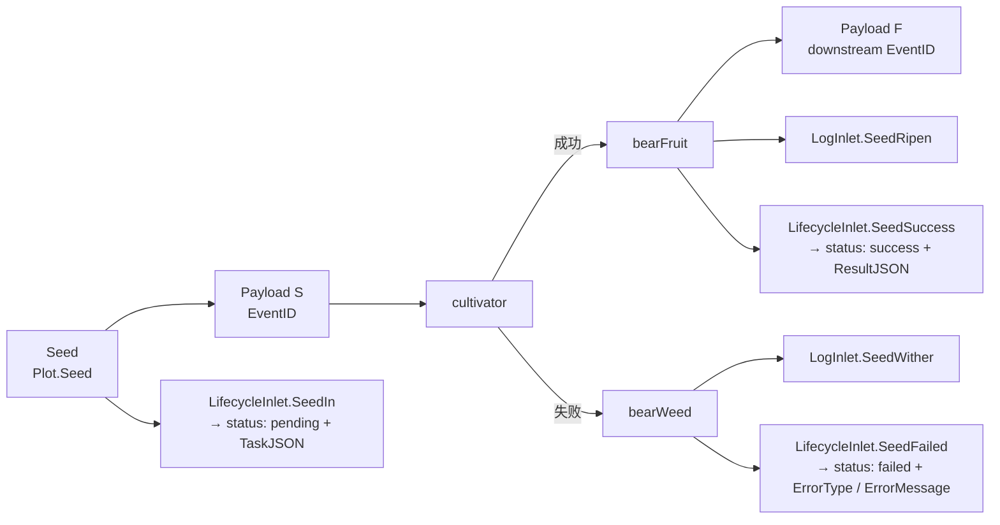

# pkg/runtime/type.go

> 最后更新日期: 2026/09/01

`type.go` 定义了跨包共享的运行时基础类型：管道阶段的统一数据载体 `Payload[V]`、控制信号常量 `SignalNone` / `SignalSeal`，以及「种子—果实」配对类型 `Karma[S, F]`。这些类型被 `pkg/plot`（用于 `seedChan` / `fruitChans`）以及 `pkg/persist`（经由 `Plot` 投递记录时）共同使用。

## 作用

- 把 **数据**（seed、fruit）和 **控制信号**（seal）统一封装在同一个泛型通道类型里，使 plot 之间的连接只需要一条 `chan Payload[X]`。
- 提供跨包共享的「成功 / 失败 / 重试中」语义底层类型，方便未来扩展。
- 提供 `Karma` 这种「种子—果实」配对类型，给上层可能需要的「回头看」接口留出空间。

> `pkg/runtime` 包**目前不包含**显式的 `Task` / `TaskResult` / `TaskStatus` / `TaskJSON` 结构体；这些名称在 `pkg/persist` 的 `LifecycleStatusRecord`（`TaskJSON` / `ResultJSON` 字段、字符串 `Status` 字段）中以 JSON 序列化后的形式出现。本文档不杜撰这些类型，仅在「与 `pkg/persist` 的对接」一节解释它们如何由 `Payload` / `Plot` 衍生。

## 核心对象

### 控制信号常量

```go
const (
    SignalNone = iota // 正常数据
    SignalSeal        // 终止信号，通知下游不再有新数据
)
```

| 常量 | 值 | 语义 |
|------|----|------|
| `SignalNone` | `0` | 通道里的这条 `Payload` 携带的是正常数据（seed 或 fruit） |
| `SignalSeal` | `1` | 通道里的这条 `Payload` 是终止信号，通知下游「本 plot 不再产生新数据」 |

设计要点：

- 用 **同一个 `chan Payload[V]`** 同时承载数据和控制流，避免为控制信号额外开辟一条通道。
- `Signal` 字段在 `SignalSeal` 时**不携带** `Value`，仅靠 `Signal == SignalSeal` 判定。
- 下游 `sprout` 在 `select` 中读到 `SignalSeal` 时，会调用 `markSealed` 判断来源（`sourceInput` 强终止 vs 上游弱终止），具体见 `plot.md`。

### `Payload[V]` 结构

```go
type Payload[V any] struct {
    // Signal与Seed通用
    Signal  int
    EventID int

    // Signal使用
    Source string

    // Seed使用
    Value V
}
```

| 字段 | 类型 | 用途 | 在 `SignalSeal` 下的语义 |
|------|------|------|--------------------------|
| `Signal` | `int` | `SignalNone`（正常数据）或 `SignalSeal`（终止信号） | 必填，固定为 `SignalSeal` |
| `EventID` | `int` | 由 `EventClient.Emit` 分配的事件 ID（见 `event.md`） | seal 事件的 ID |
| `Source` | `string` | 数据来源（外部 input 用 `sourceInput`、内部传播用 plot 名） | seal 来自哪个 plot（或 `sourceInput`） |
| `Value` | `V` | 实际数据（seed 或 fruit） | **不使用**，零值 |

> 字段含义由 `Signal` 决定：
> - `Signal == SignalNone`（正常数据）：`Value` 是有效数据；`Source` 通常为空（外部 `Seed` 注入时）或下游 plot 名（fruit 转发时）。
> - `Signal == SignalSeal`（控制信号）：`Value` 无意义；`Source` 用于下游 `markSealed` 判定来源。

### `Karma[S, F]` 结构

```go
type Karma[S any, F any] struct {
    Seed  S
    Fruit F
}
```

| 字段 | 类型 | 含义 |
|------|------|------|
| `Seed` | `S` | 一颗种子的原始输入 |
| `Fruit` | `F` | 这颗种子经过 plot 培育后产出的果实 |

> `Karma` 是「种子—果实」配对的占位结构；当前 `pkg/plot` 内部并未直接使用它，但 `pkg/runtime` 把它暴露出来供未来扩展（如：失败时也把 `Seed` 存下来做可重放缓存；或者在 `Harvest` 时返回 `[]Karma` 而非只返回状态快照）使用。

## 公开符号一览

| 符号 | 类型 | 用途 |
|------|------|------|
| `SignalNone` | `const int` | `Payload.Signal` 取值：正常数据 |
| `SignalSeal` | `const int` | `Payload.Signal` 取值：终止信号 |
| `Payload[V any]` | `struct` | 管道阶段统一数据载体，同时承载数据与控制信号 |
| `Karma[S any, F any]` | `struct` | 种子—果实配对 |

## 跨包使用约定

`Payload[V]` 几乎是 `pkg/plot` 中所有 `chan` 的元素类型：

| 通道 | 元素类型 | 来源 | 目的地 |
|------|----------|------|--------|
| `Plot.seedChan` | `chan runtime.Payload[S]` | 外部 `Seed` / 上游 fruit / seal | 当前 plot 的 `sprout` |
| `Plot.fruitChans[name]` | `chan runtime.Payload[F]` | 当前 plot 的 `bearFruit` / `sprout` 收尾 | 下游 plot 的 `seedChan` |

- 在 `Plot.Seed(seed S)` 中构造：`Payload[S]{Value: seed, EventID: seedID}`（`Signal` 默认为 `SignalNone`）。
- 在 `Plot.Seal()` 中构造：`Payload[S]{Signal: SignalSeal, Source: sourceInput, EventID: sealID}`。
- 在 `Plot.bearFruit` 向下游转发时构造：`Payload[F]{Value: fruit, EventID: downstreamSeedID}`。
- 在 `Plot.sprout` 收尾向所有下游广播 seal 时构造：`Payload[F]{Signal: SignalSeal, Source: p.name, EventID: sealID}`。

## 状态枚举（成功 / 失败 / 重试中）语义

`pkg/runtime` 包**没有**显式的 `TaskStatus` 类型；任务状态由 `pkg/persist` 的 `LifecycleStatusRecord.Status` 字段以**字符串字面量**形式维护。其取值与运行时包的对应关系如下：

| 运行时触发点 | `LifecycleStatusRecord.Status` | 说明 |
|--------------|--------------------------------|------|
| `Plot.Seed` 写入 `lifecycleInlet.SeedIn` | `"pending"` | 种子进入系统，尚未开始培育 |
| `Plot.bearFruit` 写入 `lifecycleInlet.SeedSuccess` | `"success"` | 培育成功，伴随 `ResultJSON` |
| `Plot.bearWeed` 写入 `lifecycleInlet.SeedFailed` | `"failed"` | 培育失败，伴随 `ErrorType` / `ErrorMessage` |
| `Plot.tend` 进入下一次重试 | （**不产生新状态**） | 重试仍属于 `pending`；只是内部 `attempt` 计数增加，并由 `LogInlet.SeedReplant` 写一条 `WARNING` 级日志 |

> 「**重试中**」不是 `status` 表里的独立行——重试只发生在 `Plot.tend` 的 `for attempt := 1; attempt <= p.maxRetries+1; attempt++` 循环内，对外的 `status` 行保持在 `pending`。如果需要观察重试历史，请读取 `logs/grow_log(*).log` 中 `Seed xxx attempt N withered: ... Replanting...` 这一行。
> 详细的 Option / 重试行为见 `plot.md` 与 `option.md`。

## 与 `pkg/persist` 的对接

`Payload` 本身**不**携带「任务上下文」字段——`Seed` / `Fruit` 这类业务数据由 `Plot.cultivator` 的入参和返回值承载。`pkg/persist` 通过以下两类 `Record` 把 `Payload`（以及它携带的 `EventID`）翻译成可查询的持久化结构：

- `persist.LogRecord` — 日志记录（`Plot.bearFruit` 写 `SeedRipen`，`Plot.bearWeed` 写 `SeedWither`，`Plot.tend` 重试时写 `SeedReplant`）。
- `persist.LifecycleRecord` — 生命周期记录（`Plot.Seed` → `lifecycleSeed` / `"pending"`；`Plot.bearFruit` → `lifecycleFruit` / `"success"`；`Plot.bearWeed` → `lifecycleWeed` / `"failed"`）。该记录通过 `InsertLifecycleEvent` 写入 `events` + `event_parents`，再通过 `UpsertLifecycleStatus` / `PromoteLifecycleStatusSuccess` / `PromoteLifecycleStatusFailed` 写入 `status` 表。

任务上下文（任务 JSON、结果 JSON、错误信息）的落地流程：



> `TaskJSON` 来自 `LifecycleInlet.SeedIn(plot, eventID, parentIDs, task)` 的 `task any` 参数，由 `toLifecycleJSON` 序列化为字符串；`ResultJSON` 同理来自 `SeedSuccess` 的 `result any` 参数；`ErrorType` / `ErrorMessage` 来自 `SeedFailed` 的 `err error` 参数。这些 JSON 字符串是 `Task` / `TaskResult` / `TaskStatus` 字段在持久化层的**等价表达**——如果业务侧需要强类型，可以反向 `json.Unmarshal` 进自己的 `Task` / `TaskResult` 结构体。

## 使用示例

### 在 `seedChan` 上判别数据 / 信号

```go
for {
    select {
    case p := <-seedChan:
        switch p.Signal {
        case runtime.SignalNone:
            // 正常数据
            handle(p.Value, p.EventID)
        case runtime.SignalSeal:
            // 终止信号：记录来源、关闭下游
            handleSeal(p.Source, p.EventID)
        }
    case <-ctx.Done():
        return
    }
}
```

### 构造一个发往下游的 fruit Payload

```go
fruitPayload := runtime.Payload[F]{
    Value:   fruit,
    EventID: p.eventClient.Emit("seed", []int{fruitID}),
}
ch <- fruitPayload
```

### 构造一个 seal Payload

```go
sealPayload := runtime.Payload[F]{
    Signal:  runtime.SignalSeal,
    Source:  p.name,         // 或 sourceInput
    EventID: sealID,
}
ch <- sealPayload
```

### 用 `Karma` 缓存「种子—果实」对（示例 / 占位用法）

```go
k := runtime.Karma[S, F]{Seed: seed, Fruit: fruit}
// 业务侧可以把它放进自己管理的回放缓存里
_ = k
```

## 重要细节

- **零值即「正常数据」**：`Payload.Signal` 的零值是 `SignalNone`（因为它是 `iota` 起始），所以「不写 `Signal` 字段」的 `Payload{}` 自动表示一条正常数据。`Plot.Seed` 故意只设 `Value` / `EventID`，不显式设 `Signal`。
- **`Payload` 字段是「联合语义」**：同时存在 `Signal` / `Source` / `Value` 三个字段，但实际只用到其中一部分；按 `Signal` 决定读哪些字段，不要假设所有字段都有意义。
- **重试是内部循环，不产生新事件**：`Plot.tend` 内的重试循环不会再次调用 `eventClient.Emit`，也不会写新的 `status` 行；只有最终成功 / 失败时才走 `bearFruit` / `bearWeed`。
- **`Status` 是字符串而非枚举**：`pkg/persist` 把状态写成字面量 `"pending"` / `"success"` / `"failed"`，未在 Go 类型层定义枚举常量；如果业务需要类型安全，建议在消费 `LifecycleStatusRecord` 时自行映射。

## 注意事项

- 不要为 `Payload` 引入「只能用作数据 / 只能用作信号」的多个类型——本框架的设计就是「同一条管道同时承载数据和控制流」，引入多个类型会破坏 `ConnectTo` 的类型断言。
- 不要把 `Payload.Value` 用于 `Signal == SignalSeal` 的情形；其内容未定义，可能为 `V` 的零值。
- 自定义业务结构体如果要在 `cultivator` 中被 `runtime.Payload[V]` 包装，请确保它是**可比较**或至少可被 `fmt.Sprintf("%+v", ...)` 打印（用于 `LogInlet.SeedRipen` / `SeedWither` 的 seed / fruit repr 截断），否则日志会显示成 `{}` 之类无意义输出。
- 如果需要「重试中也算失败」的语义，请把重试上限设为 `0`（`WithMaxRetries(0)`），这样首次失败会立即走 `bearWeed`，避免 `pending` 行迟迟不晋升。
- `Karma` 当前**未在 plot 主流程中使用**；引入它是预留扩展点，请避免在生产路径上依赖它。
